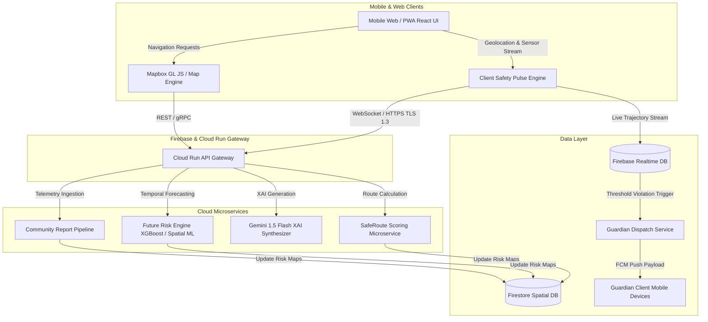
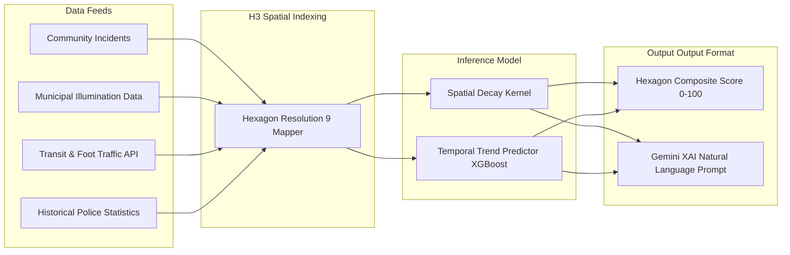
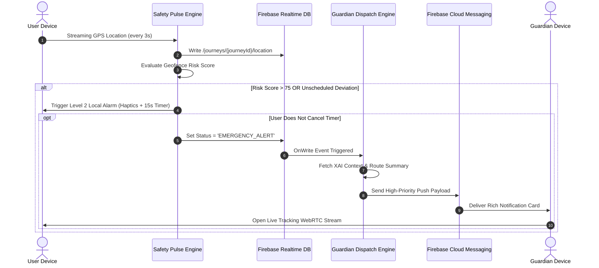

# SafeSphere AI — System Architecture & Technical Specification

> **Document Version:** 1.0.0  
> **Status:** Production Design Baseline  
> **Target Audience:** Systems Architects, Lead Engineers, AI Engineers, Infrastructure Team

---

## 1. High-Level System Architecture

SafeSphere AI is engineered as a decoupled, multi-tiered micro-service architecture designed for real-time spatial calculations, low-latency streaming telemetry, and high-availability threat forecasting.



---

## 2. Layered Architecture Breakdown

### 2.1 Frontend Architecture (Client Application)
- **Framework:** React 18 + Vite (Mobile-First PWA)
- **State Management:** Zustand (Global State, Active Route State, Guardian Session State)
- **Map & Geospatial Engine:** Mapbox GL JS v3 + Uber H3-js (Spatial hexagonal grid rendering)
- **Sensors & Telemetry:** HTML5 Geolocation API, DeviceOrientation API, Haptic Vibration API
- **Styling & Design System:** Tailwind CSS v4 + Custom Glassmorphism CSS Tokens + Framer Motion (Micro-animations)

### 2.2 Backend & Microservices Architecture
- **API Gateway & Ingress:** Node.js (Express / Fastify) deployed on Google Cloud Run (Autoscaling 0 to 100 instances).
- **Serverless Event Processors:** Firebase Cloud Functions (Node.js 20 runtime) for asynchronous background tasks:
  - `onCommunityReportSubmitted`: Triggers spatial cache invalidation and risk score recalculation.
  - `onGuardianAlertTriggered`: Compiles XAI summary and dispatches multi-channel FCM/Twilio notifications.
- **Geospatial Indexing:** H3 Spatial Indexing (Resolution level 8 for neighborhoods ~0.7 km², Resolution level 9 for micro-blocks ~0.1 km²).

---

## 3. AI Architecture & Risk Prediction Engine

### 3.1 Spatial-Temporal Risk Model Architecture
The SafeSphere Risk Engine computes a composite threat score $R(s, t)$ for a spatial coordinate $s$ at timestamp $t$.

$$R(s, t) = \alpha \cdot C(s) + \beta \cdot L(s, t) + \gamma \cdot D(s, t) + \delta \cdot H(s, t)$$

Where:
- $C(s)$: **Community Incident Density** (Kernel Density Estimation of verified community reports with time-decay weights).
- $L(s, t)$: **Illumination Deficiency Index** (Calculated from streetlight geospatial density, municipal outage reports, and solar elevation angle).
- $D(s, t)$: **Pedestrian Crowd Sparse Penalty** (Inversed cellular/transit crowd density proxy).
- $H(s, t)$: **Historical Crime Severity Index** (Geospatial historical crime rate weighted by violence severity).
- $\alpha, \beta, \gamma, \delta$: Dynamic hyperparameter weights calibrated per urban ecosystem.



### 3.2 Explainable AI (XAI) Synthesis Pipeline
When a risk score for a spatial segment exceeds a threshold (e.g., $R > 45$), the engine invokes the **Gemini 1.5 Flash XAI Synthesizer**:
1. Feature importance vectors from the scoring engine are serialized into JSON.
2. Structured prompt schema formats top 3 risk drivers.
3. Generates concise, non-alarmist bullet points under `< 50ms` latency using low-temperature streaming inference.

---

## 4. Real-Time Guardian Engine & Notification Pipeline

### 4.1 Trigger & Escalation Workflow


---

## 5. Database Schema & Data Models

### 5.1 Firestore Data Architecture

#### Collection: `users`
```json
{
  "uid": "usr_9983f2a1",
  "fullName": "Ananya Sharma",
  "email": "ananya.s@example.com",
  "phoneNumber": "+1234567890",
  "createdAt": "2026-08-03T10:00:00Z",
  "guardians": [
    {
      "guardianId": "grd_4482a1",
      "name": "Rajesh Sharma",
      "relation": "Father",
      "phoneNumber": "+1987654321",
      "fcmToken": "fcm_token_xyz..."
    }
  ],
  "preferences": {
    "safetyThreshold": 60,
    "hapticWarnings": true,
    "autoAlertGuardians": true
  }
}
```

#### Collection: `community_reports`
```json
{
  "reportId": "rep_7731b9",
  "reporterHash": "anon_e4f012a9",
  "location": {
    "latitude": 37.774929,
    "longitude": -122.419416,
    "h3Index": "8928308280fffff"
  },
  "category": "POOR_LIGHTING", 
  "severity": 4,
  "description": "Streetlights non-functional for 2 blocks behind transit stop.",
  "timestamp": "2026-08-03T12:30:00Z",
  "verificationCount": 5,
  "status": "VERIFIED"
}
```

#### Collection: `spatial_risk_index`
```json
{
  "h3Index": "8928308280fffff",
  "currentRiskScore": 78,
  "forecasts": [
    { "timeOffsetMinutes": 15, "forecastRiskScore": 82 },
    { "timeOffsetMinutes": 30, "forecastRiskScore": 88 },
    { "timeOffsetMinutes": 45, "forecastRiskScore": 91 }
  ],
  "primaryRiskFactors": [
    "12 verified harassment reports in past 30 days",
    "Illumination index below 15%",
    "Commercial activity zero after 22:00"
  ],
  "lastUpdated": "2026-08-03T13:00:00Z"
}
```

---

## 6. Directory & Codebase Structure

```
safesphere-ai/
├── README.md
├── package.json
├── vite.config.js
├── tailwind.config.js
├── firebase.json
├── firestore.rules
├── public/
│   ├── favicon.svg
│   └── icons/
├── src/
│   ├── assets/
│   ├── components/
│   │   ├── common/
│   │   │   ├── Button.jsx
│   │   │   ├── Card.jsx
│   │   │   ├── Modal.jsx
│   │   │   └── GlassContainer.jsx
│   │   ├── map/
│   │   │   ├── MapContainer.jsx
│   │   │   ├── SafeRouteLayer.jsx
│   │   │   └── RiskHeatmapLayer.jsx
│   │   ├── navigation/
│   │   │   ├── RouteSelector.jsx
│   │   │   └── FutureRiskSlider.jsx
│   │   ├── pulse/
│   │   │   ├── SafetyPulseWidget.jsx
│   │   │   └── EscalationCountdown.jsx
│   │   └── guardian/
│   │       ├── GuardianCard.jsx
│   │       └── LiveTrackingView.jsx
│   ├── context/
│   │   └── AuthContext.jsx
│   ├── hooks/
│   │   ├── useGeolocation.js
│   │   ├── useSafeRoute.js
│   │   ├── useSafetyPulse.js
│   │   └── useGuardianStream.js
│   ├── services/
│   │   ├── api.js
│   │   ├── firebase.js
│   │   ├── mapbox.js
│   │   ├── riskEngine.js
│   │   └── xaiSynthesizer.js
│   ├── store/
│   │   ├── useRouteStore.js
│   │   ├── useSafetyStore.js
│   │   └── useUserStore.js
│   ├── styles/
│   │   ├── globals.css
│   │   └── glassmorphism.css
│   └── utils/
│       ├── h3Helpers.js
│       ├── hapticManager.js
│       └── formatters.js
└── functions/
    ├── package.json
    ├── index.js
    └── triggers/
        ├── onReportSubmitted.js
        └── onGuardianDispatch.js
```

---

## 7. Security, Privacy & Compliance Architecture

1. **Anonymized Telemetry:** User locations for crowd density calculations are bucketed into H3 resolution 8 hexes and scrubbed of User IDs.
2. **Location Obfuscation:** Community reports strip exact home/office origin points using a dynamic random spatial jitter algorithm (50m–150m offset).
3. **Data Transit & Rest Encryption:** All client-server communications operate over TLS 1.3. Firestore & Realtime DB enforce AES-256 resting encryption.
4. **Firebase Security Rules:** Strict row-level security ensuring only authorized Guardians can read active `/journeys/{journeyId}` data during an active trip session.

---

## 8. Deployment Strategy

- **Frontend Web / PWA:** Automated CI/CD pipeline via GitHub Actions deploying static assets to Vercel / Firebase Hosting.
- **Backend Microservices:** Containerized Docker builds deployed to Google Cloud Run with autoscaling thresholds (`min-instances: 1`, `max-instances: 50`).
- **Realtime State & Auth:** Managed Firebase Cloud Infrastructure (US Multi-Region).
